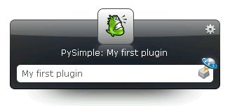

******************************************
  Howto: Writing a plugin
******************************************

.. index:: Plugin Howto

.. topic:: Abstract

   This document describes how to write a Launchy plugin using pylaunchy.
   
.. note::

   This document was written for PyLaunchy |version| and Launchy 2.1.1.

.. |ScriptsPath| replace:: ``<Launchy>\plugins\python``

Requirements
===============
In order to run the code in this document you need the following:
 * Launchy 2.1
 * Python 2.5
 * PyLaunchy |version|
 
Simple Plugin
===============
This is the simplest plugin you can build that will actually do something.
The code is taken from the pysimple.py which is distributed with pylaunchy. 

.. literalinclude:: ../../scripts/pysimple.py  
   :linenos:
   
Running
--------
 * Put the MySimplePlugin.py in |ScriptsPath| (Replace ``<Launchy>`` 
   with your Launchy install path, e.g. ``C:\Program Files\Launchy\plugins\python``).
 * Restart Launchy
 * Hit ``<Alt>`` + ``<Space>``
 * Type ``My simple plugin``
 * Hit ``<Enter>``

You should see the following image : 

Also, check the file *stdout.txt* in |ScriptsPath|. It should have the following line - ::

   I was asked to launch:  My simple plugin

PySimple exaplained
-----------------------
The following refer to the ``### 1`` comments in the code.

 1. The ``launchy`` module contains the required classes and functions for 
    writing a Launchy plugin in Python.
 2. ``launchy.Plugin`` must be initialized, or your plugin won't get loaded.
 3. The ``name``, ``hash ID`` and ``icon`` of the plugin, all required by 
    Launchy, are defined for later use. They are returned by functions called by
    Launchy and the plugin itself.
 4. Text is retrieved from the first input data. This is what the user has 
    typed without clicking `<TAB>`
 5. A new catalog item is created, containing the user text and some more.
    Note the usage of ``getID()``, it tells Launchy to use this plugin in case
    the user has selected this item.
 6. Get the best catalog item for the search query. 
    See :class:`launchy.InputData` for more details.
 7. Print something from the catalog item. Since PyLaunchy has no console to
    write to, the ``print`` output can be seen in the file *stdout.txt* 
    in |ScriptsPath|
 8. The plugin class must be registered in order to work.
 
