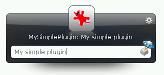

******************************************
  Howto: Writing a plugin
******************************************

.. index:: Plugin Howto

.. topic:: Abstract

   This document describes how to write a Launchy plugin using pylaunchy.
   
.. note::

   This document was written for PyLaunchy 0.6.1 and Launchy 2.1.1.

.. |ScriptsPath| replace:: ``<Launchy>\plugins\python``

Requirements
===============
In order to run the code in this document you need the following:
 * Launchy 2.1
 * Python 2.5
 * PyLaunchy 0.6
 
Simple Plugin
===============
This is the simplest plugin you can build that will actually do something.
The code is taken from the MySimplePlugin.py which is distributed with pylaunchy. 

.. literalinclude:: ../../scripts/MySimplePlugin.py  
   
Running
--------
 * Put the MySimplePlugin.py in |ScriptsPath| (Replace ``<Launchy>`` 
   with your Launchy install path, e.g. ``C:\Program Files\Launchy\plugins\python``).
 * Restart Launchy
 * Hit ``<Alt>`` + ``<Space>``
 * Type ``My simple plugin``
 * Hit ``<Enter>``

You should see the following image (your icon may vary) : 

Also, check the file *stdout.txt* in |ScriptsPath|. It should have the following line - ::

   I was asked to launch:  My simple plugin

Bla