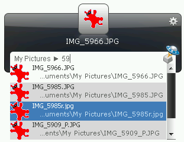
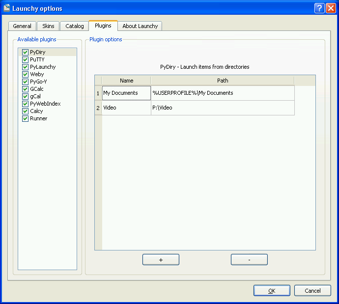
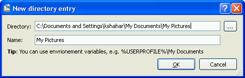

.. _pydiry:

PyDiry: Launch directories contents
===========================================

About
------
PyDiry is a Launchy python plugin that allows quick access to directory 
contents (files and directories).

The user can define a list of keywords (called *Name*) and associate them with 
directories (called *Path*). Later on, user can access the contents of these 
directories using the defined keyword.

PyDiry can be helpful if:

1. You want to search files from an exact location.
2. You frequently access some directories, but you don't want to index their
   contents using Launchy because you don't want to bloat the catalog with
   unnecessary items.
3. You want to use a different search method than the default one.

A typical usage might look like this - launching files from *My Pictures*:

Quick Tutorial
----------------
* Install PyDiry
* Restart Launchy 
* Rebuild the catalog 
* Bring up Launchy (Alt+Space) 
* Type ``My Documents``
* Select the result with the special directory icon
* Hit ``<TAB>``
* Watch as the contents of the My Documents directory are displayed
* Select one of the items and launch it

Installation
---------------
PyDiry requires the following:

* Python 2.7
* Launchy 2.5
* PyLaunchy 0.9.0

There are several ways to install:

1. Run the PyLaunchy installer or install from a binary package
2. Unpack the ``plugins/PyDiry`` from the PyLaunchy source package 
   in the ``<Launchy>\plugins\python`` directory

Adding directories
-------------------
* Open Launchy's options
* Go to "Plugins" tab
* Select PyDiry
* Hit the + button
* A dialog will open, enter the directroy name and hit the '..' button to choose
  a directory.
* Hit OK
 
The process can be seen in the following images:

Main options dialog:

New directory dialog:

Advanced searching
-------------------
PyDiry uses the **glob** Python module for file searching.

The plugin automatically adds ``*`` at the begining and the end of the search
query, but this can be changed. For example, if you want to search for files
ending with 'txt', you can type: ``*txt``.

Some queries you can try:

* ``*txt`` - all files ending with 'txt'
* ``ta*`` - all files starting with 'ta'
* ``doc?.txt`` - will match files such as 'doc3.txt', 'docy.txt', etc.

For more possible queries see the links below.

.. seealso::

   `glob - Python Module of the Week <http://www.doughellmann.com/PyMOTW/glob/glob.html>`_
      File searching with the Python **glob** module.
    
   `glob -- Unix style pathname pattern expansion <http://docs.python.org/lib/module-glob.html>`_
      Documentation of the **glob** module from Python.

Known Issues
---------------
* Folder icons do not appear
* Items or directories with non-ascii names cannot be launched.
  This is due to a bug in PyLaunchy with unicode conversions.
