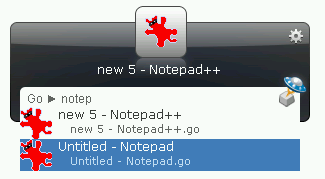

.. _pygoy:

PyGo-Y: Switch windows with Launchy
===========================================

About
------
PyGo-Y is a Launchy python plugin that activates open windows from Launchy. It's a python remake of an old Launchy plugin called Go-Y.

A typical usage might look like this:

For more history, read: http://sourceforge.net/forum/forum.php?thread_id=1702810&forum_id=677087

Quick Tutorial
----------------
 * Install pygo-y
 * Restart Launchy 
 * Rebuild the catalog 
 * Bring up Launchy (Alt+Space) 
 * Type "Go" or "Focus" and press <TAB>, then the window name you want to focus on 
 
Installation
---------------
PyWebIndex requires the following:
 * Python 2.5
 * Launchy 2.1.2
 * PyLaunchy 0.7.5

There are two ways to install:
 1. Run the PyLaunchy installer
 2. * Unpack *pygo-y.py* in ``<Launchy>\plugins\python``
    * Unpack *win32con.pyc* in ``<Launchy>\plugins\lib``
    * Unpack *win32gui.pyd* in ``<Launchy>\plugins\lib``
 
Known Issues:
--------------
 * No switching to systray applications.
