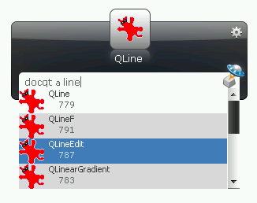
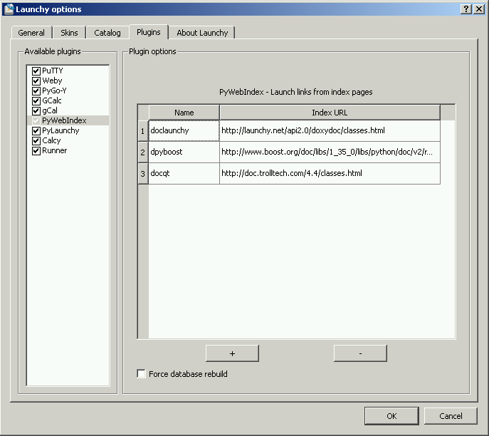

.. _pywebindex:

PyWebIndex: Launch links from index pages
===========================================

About
------
PyWebIndex is a Launchy python plugin that allows quick access to links from index pages.

It is intended for software developers wishing to access automatically generated SDK documentation such as Doxygen, although you might other find forms of use as well.

The plugin is very similar to the Weby plugin from Launchy distribution in it`s interface, but it works differently. Here the main focus is on indexing large pages with lots of links, which are not wanted as bookmarks.

A typical usage might look like this - searching for QT class that has `plugin` in it`s name:

The user can define a list of keywords (called "Name") and associate them with index pages (called "Index URL"). Later on, user can access each of the links from the index pages by using the defined keyboard.

For example, the following pages might be used with this plugin:

* http://doc.qt.nokia.com/4.6/classes.html
* http://www.boost.org/doc/libs/1_41_0/libs/python/doc/v2/reference.html
 
The plugin indexes the links in advance, meaning you should have fast access when they are needed.

Quick Tutorial
----------------
* Install PyWebIndex
* Restart Launchy 
* Rebuild the catalog 
* Bring up Launchy (Alt+Space) 
* Type ``doclaunchy<TAB>data<Enter>``
* Watch as the InputData documentation loads in your browser
 
Installation
---------------
PyWebIndex requires the following:

* Python 2.7
* Launchy 2.5
* PyLaunchy 0.9.0

There are two ways to install:

1. Run the PyLaunchy installer
2. * Unpack *pywebindex.py* in ``<Launchy>\plugins\python``
   * Unpack *BeautifulSoup.pyc* in ``<Launchy>\plugins\lib``

Adding index pages
-------------------
* Open Launchy's options
* Go to "Plugins" tab
* Select PyWebIndex
* Hit the + button
* Enter the keyword name in "Name"
* Enter the index page address in "Index URL"
 
For example, try to add the following:

* Name: docqt
* Index URL: http://doc.qt.nokia.com/4.6/classes.html

An example of the settings dialog:

 
Known Issues:
--------------
* Memory consumption can be pretty high - Launchy can take up to ~30-40MB with a decent list of index pages. This is due to the indexing feature and due to Launchy memory issues.
